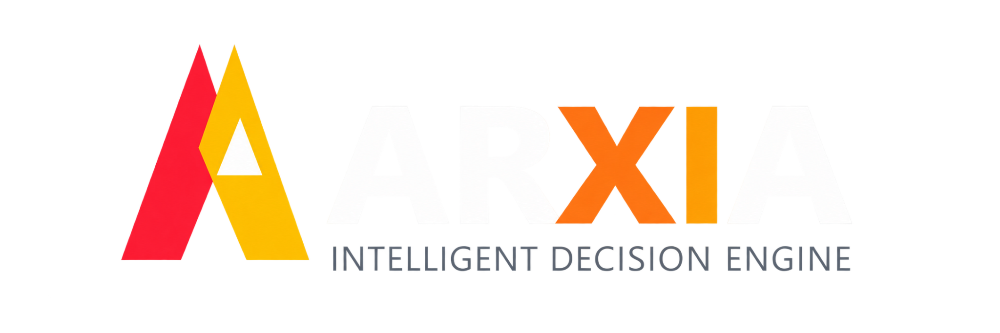

# ARXIA🏎️

<div align="center">




<br><br>

### Motor de Decisión Multimodelo para Motorsport

**Motor de decisión impulsado por IA para el análisis estratégico de carreras.**

ARXIA analiza un mismo evento de carrera mediante múltiples modelos de inteligencia artificial,
compara sus recomendaciones, evalúa el riesgo de automatización mediante reglas deterministas
y determina si la decisión puede ejecutarse automáticamente o requiere revisión humana.

<br>

</div>

---

# 🏎️ ¿Qué es ARXIA?

ARXIA es un **motor de decisión multimodelo para motorsport** diseñado para analizar situaciones estratégicas de carrera y determinar cuándo una recomendación puede automatizarse y cuándo debe intervenir un ingeniero.

ARXIA no es un chatbot de Fórmula 1.

Tampoco es un dashboard de telemetría ni una aplicación que simplemente consulta diferentes APIs.

Su objetivo es evaluar la **confiabilidad de una decisión cuando varios modelos de IA analizan exactamente el mismo problema**.

El sistema sigue el siguiente flujo:

```
                         RACE EVENT
                             │
                  ┌──────────┴──────────┐
                  ▼                     ▼
              GEMINI                    GPT
                  │                     │
                  ▼                     ▼
            AI ANALYSIS           AI ANALYSIS
                  │                     │
                  └──────────┬──────────┘
                             ▼
                       COMPARISON
                             │
                             ▼
                       RISK ENGINE
                             │
                             ▼
                     ARXIA DECISION
                       /           \
                      /             \
                     ▼               ▼
              AUTOMATIC        HUMAN REVIEW
                                      │
                                      ▼
                              ENGINEER DECISION
```

ARXIA no intenta decidir qué modelo tiene razón. Evalúa cuánto riesgo existe al confiar en una decisión.

---

### Principales características

* 🤖 Análisis concurrente con múltiples modelos LLM
* ⚖️ Comparación de recomendaciones y nivel de acuerdo
* ⚠️ Risk Engine determinista independiente de los LLM
* 🧠 Decision Engine para determinar el nivel de automatización
* 👨‍🔧 Human-in-the-Loop para revisión de decisiones
* 📊 Métricas de latencia, tokens, coste y ejecución
* 🧪 Mock Mode para testing y demostraciones

---

## 🧠 ¿Cómo funciona?

Cada evento de carrera se proporciona a los diferentes modelos utilizando un contexto estructurado.

```
Race Event
    │
    ├── Gemini
    └── GPT
         │
         ▼
   Model Comparison
         │
         ▼
    Risk Evaluation
         │
         ▼
   ARXIA Decision
         │
    ┌────┴────┐
    ▼         ▼
Automatic  Human Review
```

* La comparación identifica acuerdos y discrepancias estratégicas entre los modelos.
* El riesgo se calcula mediante reglas deterministas, no mediante otro LLM.
* Finalmente, ARXIA determina si la recomendación puede continuar por el flujo automático o debe pasar a revisión humana.

> **Model Confidence $\neq$ ARXIA Confidence**

---

## ⚠️ Risk & Decision Engine

El Risk Engine transforma diferentes señales del análisis multimodelo en un riesgo de automatización de 0 a 100.

```
0 ─────────────────────────────────── 100
LOW        MEDIUM        HIGH       CRITICAL
```

Entre las señales consideradas se encuentran:
* Model disagreement
* Confidence
* Event criticality
* Timing differences
* Provider failures
* Information availability

El Decision Engine utiliza esta evaluación junto con el nivel de acuerdo estratégico para determinar el siguiente paso:

```
                 ARXIA
                   │
          ┌────────┴────────┐
          ▼                 ▼
     AUTOMATIC         HUMAN REVIEW
                              │
                              ▼
                       ENGINEER DECISION
```

---

## 👨‍🔧 Human-in-the-Loop

Cuando una decisión requiere supervisión, ARXIA permite que un ingeniero revise y modifique la recomendación.

```
ARXIA DECISION
      │
      ▼
 HUMAN REVIEW
      │
 ┌────┴────┐
 ▼         ▼
ACCEPT   CORRECT
```

La revisión forma parte del resultado final de la ejecución.

---

## 📊 Observabilidad

ARXIA registra métricas de ejecución de los proveedores y del sistema:
* Latency
* Tokens
* Cost
* Retries

Esto permite observar tanto el comportamiento de los modelos como el coste y rendimiento de cada ejecución.

---

## 🧪 Mock Mode

ARXIA puede ejecutarse sin depender de servicios externos:
```bash
ARXIA_PROVIDER_MODE=mock
```

También puede utilizar proveedores reales:
```bash
ARXIA_PROVIDER_MODE=real
```

El Mock Mode facilita:
* Desarrollo
* Testing
* Demos
* Escenarios controlados
* Pruebas de fallos

---

🏗️ **Arquitectura**

ARXIA utiliza Clean Architecture, manteniendo la lógica de decisión separada de los proveedores externos y de la capa HTTP.

```
ARXIA/
├── api/                   # Endpoints de FastAPI y rutas principales
├── application/           # Lógica de negocio (Core, Comparison, Risk, Decision engines)
├── domain/                # Modelos de dominio, enums y estructuras de carrera
├── infrastructure/        # Proveedores externos (Gemini, OpenAI y Mock providers)
├── frontend/              # Interfaz web Mission Control (SPA / módulos)
├── tests/                 # Tests unitarios con pytest
├── requirements.txt
└── .env.example
```

Los proveedores utilizan una interfaz común, permitiendo incorporar nuevos modelos sin modificar el núcleo de decisión.

---

🤖 **AI Providers**

Los proveedores iniciales son:

```
AI Provider
    │
    ├── Gemini
    └── OpenAI
```

Ambos generan una estructura común que permite a ARXIA compararlos independientemente de su formato original de respuesta.

---

🖥️ **Web Interface**

ARXIA incluye una interfaz Mission Control orientada a race engineering.

```
RACE
├── Overview
└── Race Timeline

INTELLIGENCE
├── AI Analysis
└── Model Comparison

DECISION
├── Risk Engine
├── ARXIA Decision
└── Human Review

SYSTEM
└── System Metrics
```

También incorpora Simulation Mode para ejecutar escenarios controlados y demostraciones.

---

🧩 **Flujo completo**

```
Race Event
    ↓
Gemini + GPT
    ↓
Model Comparison
    ↓
Risk Engine
    ↓
Decision Engine
    ↓
Automatic / Human Review
    ↓
ARXIA Result
```

ARXIA separa claramente:
* AI Generation
* Model Agreement
* Deterministic Risk
* Decision
* Human Oversight

---

🚀 **Instalación**

**Requisitos:**
* Python 3.11+
* pip
* API keys de Gemini y/o OpenAI para proveedores reales

**Pasos:**
```bash
git clone <url-del-repo> && cd ARXIA

python -m venv venv

# Windows
venv\Scripts\activate

# macOS / Linux
source venv/bin/activate

pip install -r requirements.txt
```

Configurar las variables de entorno:
```bash
cp .env.example .env
```

Para ejecutar en modo mock:
```bash
ARXIA_PROVIDER_MODE=mock
```

Para utilizar los proveedores reales:
```bash
ARXIA_PROVIDER_MODE=real
GEMINI_API_KEY=your_gemini_api_key
OPENAI_API_KEY=your_openai_api_key
```

Ejecutar:
```bash
uvicorn api.main:app --reload
```

---

🎯 **Concepto**

ARXIA explora una idea sencilla:

> *No confiar en una única recomendación de IA para tomar decisiones críticas.*

En lugar de utilizar un único modelo como fuente de verdad, ARXIA combina:
* Multiple AI Models
* Model Agreement
* Deterministic Risk
* Human Oversight

> **AI can recommend.**  
> **ARXIA evaluates.**  
> **Humans remain in control.**
